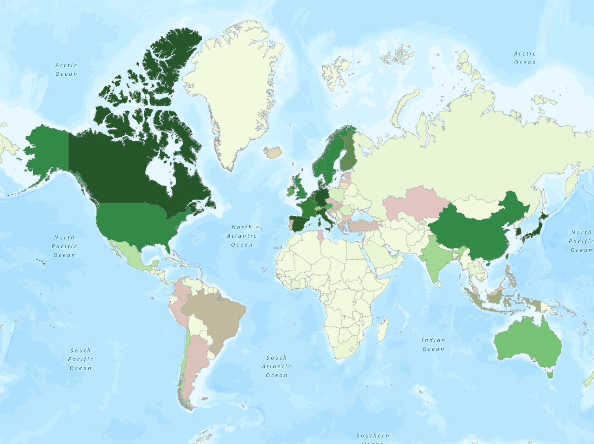

# 🌍 Global Green Bond Tracker

An interactive ArcGIS web map tracking green bond issuance across 114 countries, overlaid with the carbon footprint of bank lending portfolios. Built to answer a simple question: *Is the global financial system actually financing the green transition — or just talking about it?*

**[🗺️ View the Live Map](https://arcg.is/8D4mP0)**

---

## About the Project

Green bonds are fixed-income instruments whose proceeds are directed exclusively toward environmental projects. They've grown from a niche product into a multi-trillion-dollar asset class. But raw issuance numbers only tell part of the story. This project combines four datasets to paint a more complete picture of climate finance:

- **How much** green bond capital is each country mobilizing?
- **Who's issuing** — private sector, financial institutions, or governments?
- **How credible** are these bonds — are they independently verified?
- **What's the backdrop** — how carbon-intensive is a country's banking system to begin with?

The result is a public, interactive map where anyone can click on a country and see the full picture.

---

## Data Sources

| Source | Provider | Coverage | What It Tells You |
|--------|----------|----------|-------------------|
| [GSSS Bond Issuance](https://data360.worldbank.org/en/indicator/IFC_GB_GBAGG) | World Bank / IFC | 70 countries (emerging markets focus), 2012–2024 | Green bond issuance volume by country |
| [ESG Bond Issuances](https://climatedata.imf.org/datasets/8e2772e0b65f4e33a80183ce9583d062_0/explore) | IMF / LSEG (Refinitiv) | 90 countries (global), 2006–2024 | Green bond issuance including advanced economies, sovereign breakdown |
| [Carbon Footprint of Bank Loans](https://climatedata.imf.org/datasets/596f11fea29d429ba6c5507e3756a751_0/explore) | IMF | 40 countries, 2005–2018 | How carbon-intensive a country's bank lending portfolio is |
| [Certified Climate Bonds Database](https://www.climatebonds.net/data-insights/market-data/certified-climate-bonds-database) | Climate Bonds Initiative | 47 countries, 841 bonds | Independently verified green bonds with sector breakdown |

All data is accessed under open or public-use terms. The World Bank data is licensed under CC BY 4.0.

---

## What's on the Map

### Layer 1: Green Bond Issuance (Graduated Green)

Countries are shaded by cumulative green bond issuance in billions of US dollars. Darker green indicates higher issuance. The "best estimate" field combines the IMF/LSEG dataset (preferred, broader coverage) with World Bank data (fallback for countries only in that source), covering 114 unique countries.

### Layer 2: Carbon Footprint of Bank Loans (Graduated Red/Orange)

Countries are shaded by the IMF's CFBL indicator — a measure of how carbon-intensive a country's bank lending portfolio is. Higher values (darker red) mean banks are lending more heavily to polluting industries. Lower values (lighter yellow) indicate cleaner lending portfolios. Available for 40 countries.

### Pop-ups

Click any country to see:

- Green bond issuance (2024 and cumulative)
- Sovereign green bond issuance
- Bank loan carbon footprint index (2018)
- Carbon trend (improving or worsening)
- Number of CBI-certified bonds and their total value
- Which data sources cover that country

---

## Repository Structure

```
green-bond-tracker-project/
├── data/
│   ├── raw/                              # Original downloaded datasets
│   │   ├── IFC_GB_GBAGG.csv             # World Bank GSSS bonds
│   │   ├── Green_Bonds.csv              # IMF ESG bond issuances
│   │   ├── Carbon_Footprint_of_Bank_Loans.csv  # IMF CFBL indicator
│   │   └── bonds_export.csv             # CBI certified bonds
│   └── processed/                        # Cleaned, analysis-ready outputs
│       ├── map_data_combined.csv         # Master file (all sources merged)
│       ├── green_bonds_by_country.csv
│       ├── green_bonds_by_country_iso2.csv
│       ├── green_bonds_timeseries.csv
│       ├── green_bonds_timeseries_iso2.csv
│       ├── green_bonds_regional_aggregates.csv
│       ├── imf_green_bonds_by_country.csv
│       ├── imf_green_bonds_timeseries.csv
│       ├── cfbl_by_country.csv
│       ├── cfbl_timeseries.csv
│       ├── cfbl_green_bond_overlap.csv
│       ├── cbi_by_country.csv
│       ├── cbi_by_sector.csv
│       └── cbi_country_sector.csv
├── scripts/                              # Reproducible data pipeline (RMarkdown)
│   ├── 01_clean_world_bank_gsss.Rmd     # Clean World Bank GSSS data → green bonds only
│   ├── 02_add_iso2_codes.Rmd           # Convert ISO3 → ISO2 for ArcGIS join
│   ├── 03_clean_imf_carbon_footprint.Rmd # Clean IMF CFBL data
│   ├── 04_clean_imf_esg_bonds.Rmd      # Clean IMF/LSEG bond data + sovereign breakdown
│   ├── 05_clean_cbi_certified_bonds.Rmd # Clean CBI certified bonds database
│   └── 06_combine_for_arcgis.Rmd       # Merge all sources → single map-ready CSV
├── docs/                                 # Methodology notes (future)
└── README.md
```

---

## Methodology

### Data Pipeline

Each dataset is cleaned in its own numbered RMarkdown notebook. The notebooks are designed to run sequentially and document every transformation — filtering decisions, code mappings, handling of edge cases (e.g., Namibia's ISO2 code `"NA"` being misread as a null value), and joins between datasets.

The final notebook (`06_combine_for_arcgis.Rmd`) merges all four sources into a single CSV keyed by ISO 3166-1 alpha-2 country codes. Where datasets overlap (World Bank and IMF both cover ~49 countries), both values are preserved in separate columns, with a "best estimate" column that prefers the IMF/LSEG data for its broader global coverage.

### Key Indicator: Carbon Footprint of Bank Loans

The CFBL indicator, developed by the IMF, quantifies the carbon intensity of a country's bank lending portfolio. It works by weighting each industry sector's share of domestic bank loans by that sector's carbon emission factor (tonnes of CO2 per dollar of output), then summing across all sectors.

We use the **emission multipliers** variant, which captures both direct emissions and indirect upstream supply-chain emissions. A higher CFBL means a country's banking system is more exposed to carbon-intensive industries.

### Analytical Insight

The map reveals meaningful contrasts. For example:

- **Kazakhstan** has the highest carbon footprint of bank loans (1,205) among all countries in the dataset, with a worsening trend, yet has issued virtually no green bonds — a significant gap in transition finance.
- **Brazil** has a moderate carbon footprint (269) and is one of the largest green bond issuers in the emerging market space at $25.3B cumulative.
- **Indonesia** pairs a high carbon footprint (645) with meaningful green bond issuance ($11.4B), potentially indicating active use of green finance to fund the energy transition.

---

## How to Reproduce

### Prerequisites

- **R** (4.0+) with packages: `tidyverse`, `countrycode`, `knitr`
- **ArcGIS Pro** (for map creation and publishing)
- **ArcGIS Online** account (for hosting the web map)

### Steps

1. Clone this repository
2. Download the raw datasets from the URLs listed above into `data/raw/`
3. Open each RMarkdown notebook in RStudio and knit in order (01 through 06)
4. The final output `data/processed/map_data_combined.csv` can be joined to any world countries boundary layer using the `ISO2` field

---

## Limitations

- The **CFBL data ends in 2018** — this is the most recent year available from the IMF. The green bond data extends to 2024, creating a temporal mismatch in the overlay analysis.
- The **World Bank dataset focuses on emerging markets** and does not include most advanced economies. The IMF/LSEG dataset fills this gap but uses a different methodology, so values for overlapping countries may differ.
- **CBI certification is voluntary** — the absence of CBI-certified bonds in a country does not mean no green bonds exist there, only that none have been submitted for third-party verification under the Climate Bonds Standard.
- **Self-labeled green bonds** are included in the IMF and World Bank datasets without independent verification of their environmental claims.
- **ArcGIS Pro is proprietary software.** While this repository's data and scripts are open, the mapping workflow requires an ArcGIS license. The processed CSV can alternatively be used with open-source GIS tools like QGIS.

---

## Future Work

- Incorporate time-enabled layers to visualize the growth of green bond markets over time
- Add the Climate Bonds Initiative sector breakdown as a chart within pop-ups
- Explore bivariate symbology to show green bond issuance and carbon footprint simultaneously in a single layer
- Update CFBL data when the IMF releases newer vintages
- Add additional indicators from the IMF Climate Data Dashboard (e.g., climate adaptation spending, renewable energy investment)

---

## License

The code and documentation in this repository are available under the [MIT License](LICENSE). The underlying datasets are subject to their respective providers' terms of use.

---

## Acknowledgments

Built as part of an environmental data science project at the University of Pittsburgh. Data provided by the World Bank, International Monetary Fund, and Climate Bonds Initiative.
